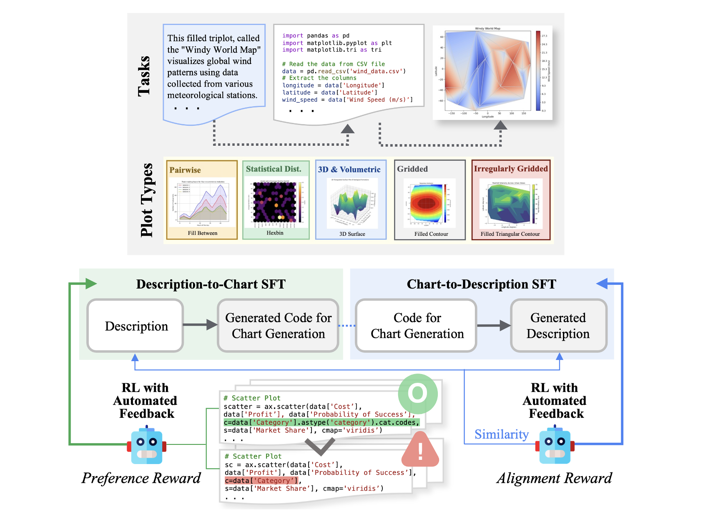

# Text2Chart31
Official PyTorch implementation of **"Text2Chart31: Instruction Tuning for Chart Generation with Automatic Feedback"**

> **Abstract** *Large language models (LLMs) have demonstrated strong capabilities across various language tasks, notably through instruction-tuning methods. However, LLMs face challenges in visualizing complex, real-world data through charts and plots. Firstly, existing datasets rarely cover a full range of chart types, such as 3D, volumetric, and gridded charts. Secondly, supervised fine-tuning methods do not fully leverage the intricate relationships within rich datasets, including text, code, and figures. To address these challenges, we propose a hierarchical pipeline and a new dataset for chart generation. Our dataset, Text2Chart31, includes 31 unique plot types referring to the Matplotlib library, with 11.1K tuples of descriptions, code, data tables, and plots. Moreover, we introduce a reinforcement learning-based instruction tuning technique for chart generation tasks without requiring human feedback. Our experiments show that this approach significantly enhances the model performance, enabling smaller models to outperform larger open-source models and be comparable to state-of-the-art proprietary models in data visualization tasks.*

## Dataset File
- Code, Description, Data Table and Reasoning Step: 
    - Training set (Text2Chart31): `./prepare-data/Text2Chart-31-train.json`
    - Test set: `./prepare-data/Text2Chart-31-test.json`.
- Dataset file including the figures: 
    - Training set (Text2Chart31) : [download](https://drive.google.com/file/d/1RpczOjGgwEhS1ufsnf8F7BNeDxTyhHzO/view?usp=sharing)
    - Test set: [download](https://drive.google.com/file/d/1tZZc-xg44Lo8IcHHxIv9yIhE3WmtX0qZ/view?usp=sharing)

- Text2Chart31-v2:
   - As pointed out in tabel 1 `Text2Chart31-v2
is constructed and published at the camera ready version of the paper, and the experiment results in this paper
is conducted with Text2Chart31`. We will upload the experimental results of Text2Chart31-v2 on this github page soon. However you can download Text2Chart31-v2 here [download](). 

## LoRA checkpoints
Unzip it under `checkpoint` folder and run inference code.
### Supervised fine-tuned model

| Task  | Model | Checkpoints |
| :------ | :------ | :------: |
| Task 1 | Llama 3 Instruct | [download](https://drive.google.com/file/d/1bpNqSxy03FcGsAwOxk29QbqgUJGh20cK/view?usp=drive_link) |
| Task 1 | Code Llama 13B   | [download](https://drive.google.com/file/d/1smThJejaxn5uyepZ0cmtmaDXXxxZPR9I/view?usp=drive_link) |
| Task 2 | Llama 3 Instruct | [download](https://drive.google.com/file/d/15g-ufsMV80zz8zHgvyk4FVuHI9USbl2s/view?usp=sharing) |
| Task 3 | Llama 3 Instruct | [download](https://drive.google.com/file/d/1sWjyLsosVx_dNN1pYS56XVlwuW3TR8xJ/view?usp=sharing) |

### RL-tuned model

| Task  | Model | Checkpoints |
| :------ | :------ | :------: |
| Task 1 | Llama 3 Instruct | [download]() |
| Task 3 | Llama 3 Instruct | [download]() |
| Task 1 | Code Llama 13B   | [download](https://drive.google.com/file/d/1DS_mMNOJA3bWYi-0XsgwbrKvEc8ffNQl/view?usp=sharing) |

Llama 3 Instruct models for Task 1 and Task 3 are jointly optimized with our algorithm here.

## Reward model checkpoint
- OPT model (Llama 3 Instruct): [download](https://drive.google.com/file/d/1mlS4jluyJQQOgf2h7PIiCq_lsb7H5lDc/view?usp=sharing)

- OPT model (Code Llama 13B): [download](https://drive.google.com/file/d/1CG7kBd8o58MQjQb8oDVS2ZiAPQcSxomB/view?usp=sharing)
## Training code

### Supervised fine-tuning
- Task 1 (Llama 3 Instruct): Run `python sft-task1.py`
- Task 1 (Code llama 13B): Run `python sft-task1-cli.py`
- Task 2: Run `python sft-task2.py`
- Task 3: Run `python sft-task3.py`

### RL fine-tuning
- Task 1 & Task 3 (Llama 3 Instruct): Run `python rl-task1-task3.py` (You would need to download reward model/SFT model checkpoints beforehand).
- Task 1 (Code Llama 13B) : Run `python rl-task1-cli.py`

## Generating samples

### Task 1
- Llama 3 Instruct:
    - Base model : Run `python generate-llama3-base.py`
    - SFT model : Run `python generate-llama3-bf16-sft.py`
    - RL model : Run `python generate-llama3-bf16-rl.py`

- Code Llama 13B:
   - Base model: Run `python generate-cli-base.py`
   - SFT model: Run `python generate-cli-sft.py`
   - RL model: Run `python generate-cli-bf16-rl.py` 
### Task 2
- SFT model : Run `python generate2-llama3-sft.py` (You would need to train the model beforehand).

### Task 3
- Base model : Run `python generate3-llama3-base.py`
- SFT model : Run `python generate3-llama3-bf16-sft.py`
- RL model : Run `python generate3-llama3-bf16-rl.py`

## Evaluation
We will release the evaluation code soon!

# Citation
If you find this code useful, please don't forget to cite the paper! 🙂

